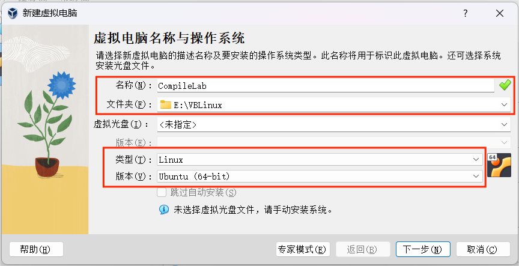
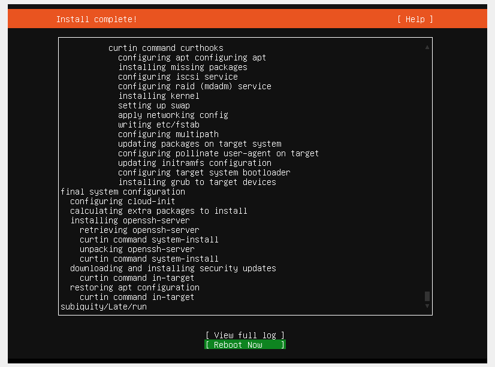
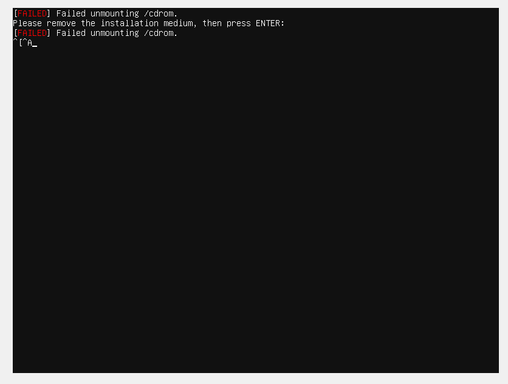
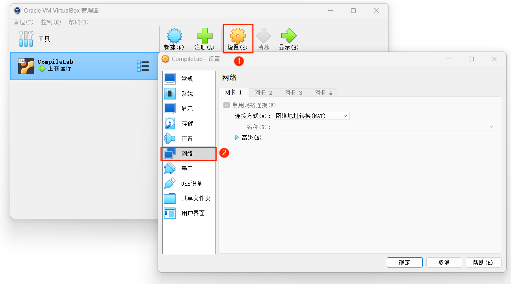
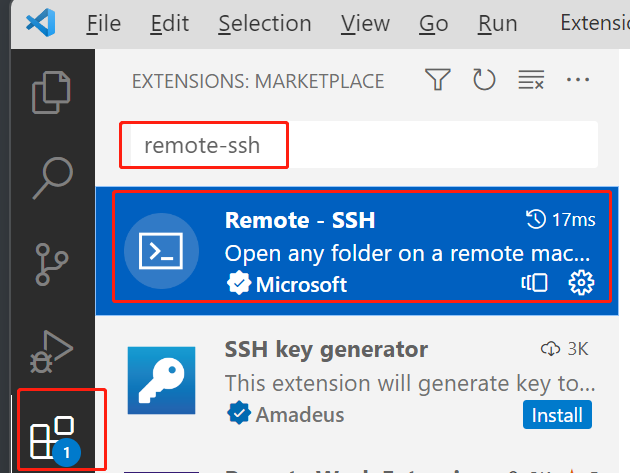
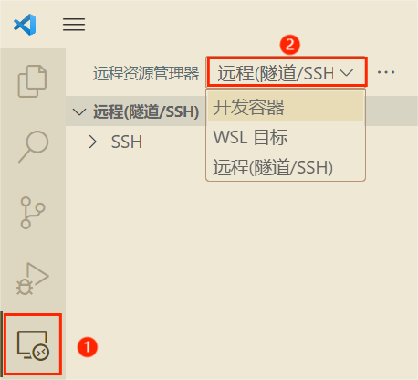

# Linux 环境配置

本页文档用于对本学期实验所使用的实验环境进行说明并提供相应的搭建建议。

本学期实验使用的**核心软件**版本为：

- Ubuntu 22.04
- LLVM 14.0.0
- Git 2.34.1
- CMake 3.22.1
- Flex 2.6.4
- Bison 3.8.2

本学期实验规定了相应的 Ubuntu 版本以方便后续软件的下载与使用，请各位同学**务必**下载使用推荐版本。

> 该文档主要针对非 Linux 系统用户，已搭建好 Linux 环境并且符合我们的实验要求的同学可跳过。

本实验文档仅提供使用虚拟机搭建环境的方法，使用的虚拟机软件为 VirtualBox。

## 1.1 下载

下载虚拟机软件：

- VirtualBox：[Downloads – Oracle VM VirtualBox](https://www.virtualbox.org/wiki/Downloads)

虚拟机软件的版本没有规定的要求，但必须满足基本需求。

下载 Ubuntu：

- 官网链接：[Ubuntu Releases](https://releases.ubuntu.com/)
- 科大镜像：[Index of /ubuntu-releases/ (ustc.edu.cn)](https://mirrors.ustc.edu.cn/ubuntu-releases/)
- 清华镜像：[Index of /ubuntu-releases/ | 清华大学开源软件镜像站 | Tsinghua Open Source Mirror](https://mirrors.tuna.tsinghua.edu.cn/ubuntu-releases/)

注意本学期推荐使用的 Ubuntu 版本为 **22.04**，请下载时选择相应版本。

> 镜像文件请下载 **server** 版本，后续指导基于 server 版本展开。请下载命名为 ubuntu-22.04.3-live-server-amd64 的镜像文件

下载完成之后无需打开镜像文件，只需在后续导入虚拟机软件即可。

## 1.2 创建、安装虚拟机（VirtualBox）

下面介绍 VirtualBox 创建、安装虚拟机的过程。

1. 点击“新建”创建虚拟机。设置虚拟机的名称，指定文件夹，设置类型与版本，虚拟光盘可以先不用指定：
   
2. 下一步后给虚拟机分配内存，请至少分配 2GB 以上的内存给虚拟机。对于处理器的分配可结合个人情况进行分配：
   
3. 下一步后给硬盘分配空间：
   
   如果各位同学只将该虚拟机用于本学期的实验那么设置最大磁盘大小为 25~40GB 即可，本学期的实验不会占用过多磁盘空间。但**不建议将磁盘大小设置过小**，因为磁盘空间不够引发的相关问题将会非常棘手。
4. 下一步后点击完成，虚拟机已经创建完毕，点击启动进入虚拟机：
   
5. 启动虚拟机后其会提示加载虚拟光盘，在这里选择我们先前已经按照的 Ubuntu 镜像文件：
   
6. 选择完毕后点击挂载并尝试启动，等待其出现如下的界面：
   
   按图示选择第一项后点击回车即可，以下**选择确认时均需回车**。
7. 以后出现的界面选择较简单，选择默认选择即可；
8. 选择至出现下述界面，按自己喜好进行填写即可：
   
   > 务必记住 username 以及 password
9. 填写完后一路按照默认选择至如下界面并且下方出现 Reboot 时选择 Reboot 即可；注意当出现下述界面时需要**保持等待**直到其出现 Reboot 按键：
   
10. 等待重启过程中如果界面卡住不发生变化时可以尝试按回车，例如出现如下界面时可按回车尝试解决：
    
11. 等到出现如下界面时输入你的用户名以及密码即可成功登录：
    
12. 出现此界面后即表示配置成功：
    

## 1.3 使用 VSCode

VSCode 是一款由微软开发的强大的跨平台代码 (文本) 编辑器。它的界面美观而且可以轻松更换界面主题以及背景；更重要的是它包含许多有用的插件，如代码高亮、智能代码自动补全、括号匹配和代码比较等，它们可以极大地提升你的工作效率；不仅如此，我们也可以通过 VSCode 方便地与远程服务器进行连接，比如我们可以通过 VSCode 与虚拟机进行连接，这样我们即可享用 VSCode 的代码编写环境，也可享用已经配置好的 Linux 环境。熟悉使用 VSCode 可以极大地提升你完成后续实验的效率。

### 1.3.1 下载 VSCode

前往[官网](https://code.visualstudio.com/download)进行下载即可。

### 1.3.2 配置 VSCode［可选］

对 VSCode 进行基础配置可以参考[链接](https://zhuanlan.zhihu.com/p/87864677)。

对 VSCode 进行插件安装可以参考[链接](https://zhuanlan.zhihu.com/p/487406915)。

## 1.4 通过 VSCode 连接虚拟机

在开始指导连接虚拟机之前，我们需要明确一个重要事实：VSCode 并非用于直接连接虚拟机的工具，而是一款专注于代码（文本）编辑的应用程序。我们实际上是通过一种特殊的方式来实现虚拟机连接，而这种方式允许我们在 VSCode 中享受代码编写的环境。这个特殊的方式就是 SSH。

### 1.4.1 SSH

SSH 全称 Secure Shell，安全外壳协议。它是一种加密的网络传输协议，可在不安全的网络中提供相对安全的传输环境。它在传输时可以将登录信息全部加密，并且在传输过程中通过在网络中创建安全隧道来实现 SSH 客户端和服务器之间的连接，这种方式极大地提高了网络传输的安全性，目前已经成为所有操作系统的标准配置。所以我们既可以在 Windows 系统上使用它，也可以在配置好的 Linux 系统上使用它。

#### 1.4.1.1 在 Linux 系统上下载 SSH

执行以下命令：

```shell
$ sudo apt install ssh openssh-client openssh-server
```

检验是否安装成功，输入下述命令：

```shell
#辨识ssh的配置文件格式
#若能查看到ASCII text 说明其已经存在,如果返回 No such file or directory 错误，说明没有安装 SSH 命令。
$ file /etc/ssh/ssh_config
/etc/ssh/ssh_config: ASCII text
```

```shell
#辨识ssh服务的配置文件格式
#若能查看到ASCII text 说明其已经存在,如果返回 No such file or directory 错误，说明没有安装 SSH 服务。
$ file /etc/ssh/sshd_config
/etc/ssh/sshd_config: ASCII text
```

#### 1.4.1.2 虚拟机设置

这里我们需要先对虚拟机的网络进行设置。

1. 打开虚拟机启动界面，在设置中选择网络：

   

2. 这里连接方式选择 <u>**NAT**</u>，在高级中选择端口转发：

   

3. 在出现的界面中添加一个规则：

   

   > 端口：这是计算机网络课程将会学到的知识，我们这里作一个简述：在因特网中，主机由其 IP 地址 (IP address 标识)，它是一个 32 比特的量且它能够唯一标识主机。当我们在两个主机之间进行网络通信时，发送主机通过发送进程来发送通信内容，而接收主机也是通过一个进程来接收发送主机发送来的内容，因此发送进程除了接收主机的主机地址 (由 IP 地址标识) 还必须知道接收主机上的接收进程。而每一个主机上运行的进程是相当多的，于是主机通过给每一个进程保留一个端口号使得进程之间的通信准确无误。
   >
   > 端口转发&端口转发规则：通过阅读端口的解释我们可以推断出端口转发就是用于帮助我们进行连接的。当规定了端口转发规则后就可以将主机的端口与虚拟机的端口绑定在一起。以上图中的规则为例，当我们建立连接时，信息从通过主机的 1145 端口转发到虚拟机的 22 端口从而实现连接。

   规则的名称可以自行命名，主机 IP 与子系统 IP 可以不填，子系统端口**必须是 22**(为什么？)，主机端口可以随意但注意不产生端口冲突即可

4. 添加完后点击确认即可。

#### 1.4.1.3 在 Windows 系统上下载使用 SSH

这里我们使用 OpenSSH 用于在 Windows 系统上使用 SSH. OpenSSH 是目前最流行的 SSH 协议实现，且是开源项目，微软已经支持在 Windows 上使用 OpenSSH。

从 Windows10 开始系统自带 OpenSSH 客户端，在 "设置"->"应用"->"可选功能"可以看到是否已经安装 OpenSSH 客户端：


若没有安装，请参考[这里](https://blog.csdn.net/fjw044586/article/details/110940729#前言)。

#### 1.4.1.4 使用 ssh 连接虚拟机

打开 Windows PowerShell，在命令行输入以下内容进行 ssh 连接：

```shell
# -p 表示端口 后面数字为端口号
ssh -p 1145 虚拟机用户名@127.0.0.1
```


输入虚拟机用户对应的密码即可链接到虚拟机当中。

### 1.4.2 使用 VSCode 连接虚拟机

由于在 VirtualBox 上配置的 Ubuntu server 只具有终端界面，不够美观的同时也无法可视化操作。这里我们推荐使用 VSCode 连接我们刚刚配置好的虚拟机，使用 VSCode 进行开发可以大大提高我们的开发效率。

在验证 ssh 连接虚拟机成功后，我们即可以通过 VSCode 来连接虚拟机。

#### 1.4.2.1 VSCode 设置

打开 VSCode 执行以下操作：

1. 下载并安装 Remote-SSH 插件：

   

   > remote-ssh 是一个专门用于通过 SSH 来远程连接服务器的辅助工具。

2. 下载完毕后在 VSCode 的左边栏找到远程资源管理器，在上方选择栏中选择**远程 (隧道/SSH)**：

   

3. 在 SSH 中点击设置，后选择 SSH 配置文件：

   

4. 在配置文件中加入如下代码段，保存：

   ```
   Host vbox			//这里名字可以随意
       HostName 127.0.0.1
       User test			//填入你自己的虚拟机 username
       Port 4514			//填入在设置虚拟机网络时你填入的主机端口
   ```

   随后刷新左侧列表可以在 SSH 下看到如下项：

   

5. 在自己设置的项 (助教这里是 VirtualBox ) 右侧点击右箭头开始连接：

   

6. 这里出现的 platform 选择 Linux：

   

7. 随后点击 Continue；

8. 输入你的虚拟机的密码；

9. 耐心等待连接，等到界面左下方出现如下情况即表示连接成功：

   

10. 随后即可在 VSCode 上愉快地使用虚拟机。VSCode 拥有一系列针对各种语言的插件，同学们按需安装，这里不再做过多展开。

#### 1.4.2.2 VSCode 连接虚拟机使用示例

我们已经成功通过 VSCode 连接了虚拟机，下面是一些简单的使用指导。

首先在 VSCode 中，我们可以使用快捷键`` CTRL + ` ``打开终端：


注意这个终端里的所有指令都是运行在你配置的虚拟机/服务器上，尝试如下指令:

```shell
# 查看虚拟机的相关信息
$ uname -a
Linux gpu12 5.4.0-156-generic #173-Ubuntu SMP Tue Jul 11 07:25:22 UTC 2023 x86_64 x86_64 x86_64 GNU/Linux

# mkdir 创建文件夹
# code 指令是VSCode专有指令，用于打开一个特定的工作区
$ mkdir Test
$ code Test
```

此时，会弹出一个新的 VSCode 窗口，该新窗口以 Test 文件夹作为 workspace。

下面，我们进行简单的文件创建和添加。选择 VSCode 的 explorer，并点击新建文件操作，新建文件`testfile.txt`。


随后打开该文件，并输入相关信息。此时，我们已经通过 VSCode 在虚拟机上创建一个`testfile.txt`文件，且该文件位于`Test`文件夹下。


完成上述操作后，你可以在 VSCode 终端中或 virtualbox 的界面，在虚拟机中查看相关文件内容。

```shell
#ls查看当前目录下的文件及文件夹，cd 进入指定目录， vim使用 Linux自带的文本编辑器
$ ls
$ cd Test
$ cat testfile.txt
Hello VirtualBox!
```

通过这个例子，你应该已经掌握了使用 VSCode 连接远程服务器和修改相关文件等操作。

VSCode 还提供文件上传和下载等操作：

- 文件上传：直接拖拽桌面文件进入 VSCode 的 explorer
- 文件下载：在 VSCode 的 explorer 中对相关文件进行右键并选择下载。

更多关于 VSCode 的操作，欢迎同学自行探索。
