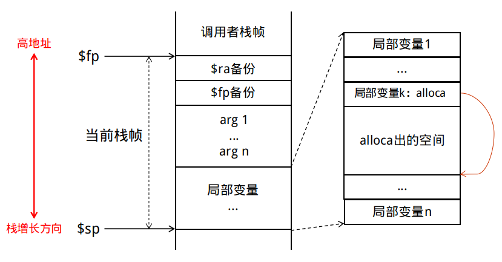

# 栈式分配介绍

本篇文档介绍后端代码生成中栈式分配的核心思想及实验方案，我们假设你已经阅读了[龙芯汇编介绍](../common/asm_intro.md)章节，并基本了解了龙芯的寄存器、汇编指令、调用规范等。

## 核心思想

栈式分配，是指**程序的所有变量都保存在栈上**，只在参与计算时提取到寄存器中。

在栈式分配策略下，编译器后端主要分为两个步骤：

1. **变量分配**：为程序中的每个变量分配一个栈帧位置，即相对栈指针的一个偏移量

2. **指令选择**：对于指令 $u= v_1 \ op\ v_2$
   1. 将两个操作数（$v_1$ 和 $v_2$）对应的数据分别从栈上提取到寄存器中（load）
   2. 根据指令类型选择合适的汇编指令（可能有多条）
   3. 将计算结果存储到栈上（store）

而在寄存器分配策略下，变量活跃期间数据都保留在各自的寄存器中，不需要 2.a 的 load 和 2.c 的 store。所以性能上，栈式分配不如寄存器分配，而在实现难度上，栈式分配要简单许多。


## 实验方案

关于变量分配，我们需要为函数中每个变量分配一段栈空间，这个并没有固定的标准，我们提供并已经为你实现好的方案如下：

- 记录每个变量相对于栈底 `$fp` 的偏移，由于栈从高向低生长，所以这个偏移量为负数
- 固定备份两个寄存器：`$ra` 和 `$fp`
- 备份函数参数
- 为每个存在定值的指令分配相应的空间
- 对于 `alloca` 指令，`alloca` 本身的定值为指针类型，`alloca` 的空间紧挨着这个这个指针，在更靠近栈顶的位置

即我们的栈帧结构如下：



!!! note "注意"

    为变量分配空间，实际上就是移动栈指针，这里注意 `$sp` 和 `$fp` 需要**对齐到 16 字节**，详见[汇编介绍中的栈帧布局章节](../common/asm_intro.md/#栈帧布局)。
    
!!! note "代码"
    
    查阅框架中的代码实现：`src/codegen/CodeGen.cpp` 中 `CodeGen::allocate()`

## 举个例子

例如如下的 Cminusf 程序：

```c
int main(void) {
    int a;
    a = 1;
    return a;
}
```

生成的 IR 文件（部分）如下：

```c
define i32 @main() {
label_entry:
  %op0 = alloca i32
  store i32 1, i32* %op0
  %op1 = load i32, i32* %op0
  ret i32 %op1
}
```

在栈式分配策略下：

1. 变量分配：为 `alloca` 指令分配一个 `i32` 类型的空间，为 `%op0` 和 `%op1` 分配栈帧空间。算上备份的寄存器，汇编代码中 `main` 函数的栈帧如下：

   |         栈帧内容         | 宽度 (byte) | 栈帧位置（相对 `$fp` 的偏移） |
   | :----------------------: | :---------: | :---------------------------: |
   |          `$ra`           |      8      |              -8               |
   |          `$fp`           |      8      |              -16              |
   |       `i32* %op0`        |      8      |              -24              |
   | `alloca` 出的 `i32` 空间 |      4      |              -28              |
   |        `i32 %op1`        |      4      |              -32              |

2. 指令选择：以 IR 中第 5 行的 `%op1 = load i32, i32* %op0` 为例，首先需要将 `%op0` 的值从栈帧加载到寄存器中，然后使用汇编指令 `ld.w` 读取内存，结果即为 `%op1` 的值，最后将其保存回 `%op1` 所在的栈帧位置。

得到的汇编指令如下（建议你读懂数字的来由）： 

```asm
	.text
	.globl main
	.type main, @function
main:
	# prologue
	st.d $ra, $sp, -8
	st.d $fp, $sp, -16
	addi.d $fp, $sp, 0
	addi.d $sp, $sp, -32
.main_label_entry:
	# %op0 = alloca i32
	addi.d $t0, $fp, -28
	st.d $t0, $fp, -24
	# store i32 1, i32* %op0
	ld.d $t0, $fp, -24
	addi.w $t1, $zero, 1
	st.w $t1, $t0, 0
	# %op1 = load i32, i32* %op0	<-- 刚刚详细介绍过的指令
	ld.d $t0, $fp, -24
	ld.w $t0, $t0, 0
	st.w $t0, $fp, -32
	# ret i32 %op1
	ld.w $a0, $fp, -32
	b main_exit
main_exit:
	# epilogue
	addi.d $sp, $sp, 32
	ld.d $ra, $sp, -8
	ld.d $fp, $sp, -16
	jr $ra
```
